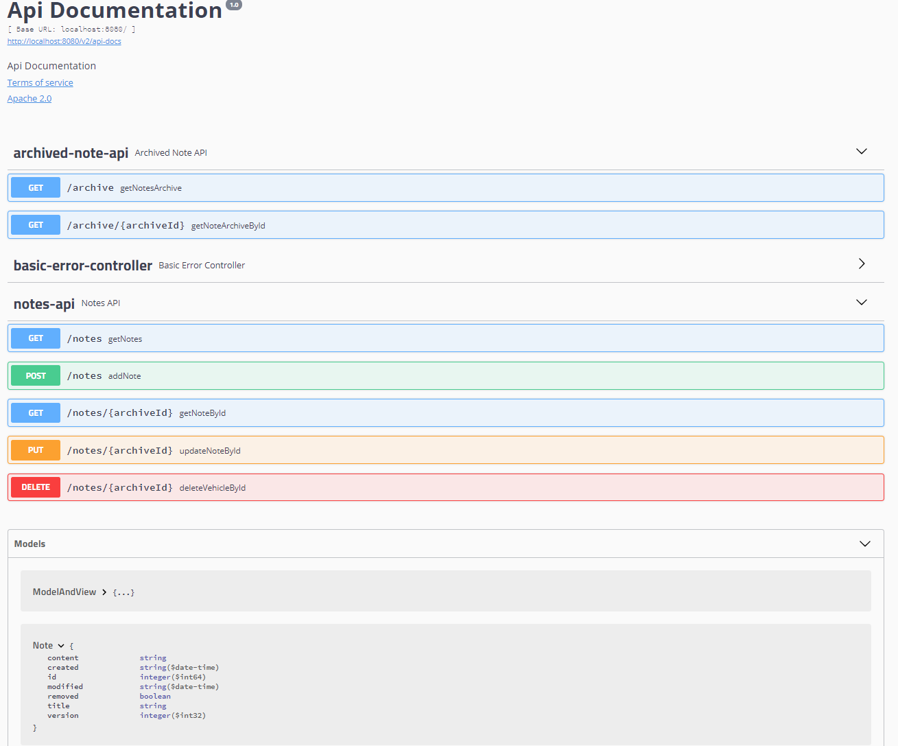

# Notes_API
Webservice for sharing notes

Documentation screen from SwaggerUI:

a.	What is required for running the project?

For running the project we need Java and NPMJS, nodeJS

b.	Steps how to run scripts that will setup database for the project

MySQL Database Server to be installed and configure 

c.	Steps how to build and run the project

To run Spring Boot app you have to build app with Maven and start by command:
$ java -jar target/yourProject.jar

d.	Example usages (i.e., like example curl commands to CRUD the notes)
Examples above on screenshot
